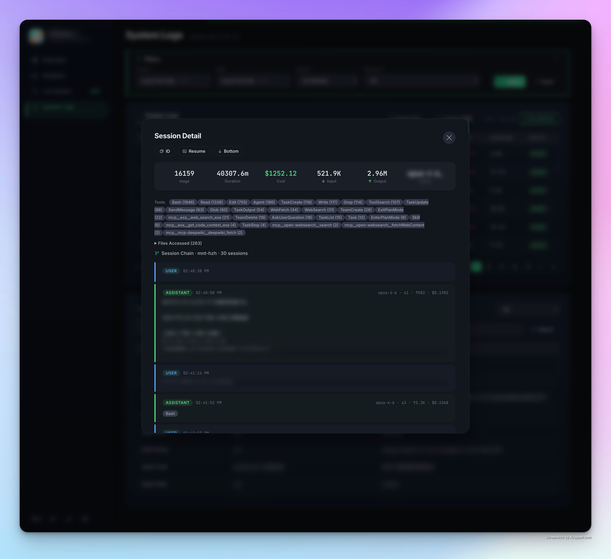

<div align="center">
  
  <h1>✨ CCDash</h1>
  <p><strong>The missing analytics dashboard for Claude Code CLI</strong></p>
  <p><em>Know exactly where every token goes. No API key needed.</em></p>

  <p>
    
    
    
    
  </p>

  <p>
    <a href="https://zihenghe04.github.io/CCDash/"><strong>🌐 Live Demo</strong></a> &bull;
    <a href="#-why-ccdash">Why?</a> &bull;
    <a href="#-features">Features</a> &bull;
    <a href="#%EF%B8%8F-screenshots">Screenshots</a> &bull;
    <a href="#-quick-start">Quick Start</a> &bull;
    <a href="#-remote-monitoring">Remote</a> &bull;
    <a href="#%E4%B8%AD%E6%96%87%E6%96%87%E6%A1%A3">中文</a>
  </p>
</div>

---

## 🤔 Why CCDash?

You're paying for a Claude subscription. But do you actually know:

- 💸 **How much would your usage cost** at API rates? (Spoiler: probably a lot more than $20/mo)
- 📊 **Which model eats the most tokens?** Opus? Sonnet? How much cache hit are you getting?
- ⏱️ **What's your average response time?** Is it getting slower?
- 🔥 **Are you about to hit the rate limit?** How much of your 5h/7d quota is used?

**No existing tool answers these for Claude Code CLI subscribers.** CCDash does.

### How is this different?

| | CCDash | Claude.ai Settings | NewAPI / One API | Karma | Dragon-UI |
|---|:---:|:---:|:---:|:---:|:---:|
| Works with **subscriptions** (no API key) | ✅ | ✅ | ❌ | ✅ | ✅ |
| Per-call **cost estimation** | ✅ | ❌ | ✅ | ✅ | ✅ |
| **RPM / TPM / burn rate** | ✅ | ❌ | ✅ | ❌ | ✅ |
| **TTFT** & duration tracking | ✅ | ❌ | ✅ | ❌ | ❌ |
| **Cache efficiency** grading | ✅ | ❌ | ❌ | ✅ | ✅ |
| **Session detail** timeline | ✅ | ❌ | ❌ | ✅ | ❌ |
| **Session chain** tracking | ✅ | ❌ | ❌ | ✅ | ❌ |
| **Tool / work mode** analytics | ✅ | ❌ | ❌ | ✅ | ✅ |
| **Coding rhythm** analysis | ✅ | ❌ | ❌ | ✅ | ❌ |
| **Multi-server** aggregation | ✅ | ❌ | ✅ | ❌ | SSH |
| **5h + 7d quota** tracking | ✅ | ✅ | ❌ | ❌ | ❌ |
| **Privacy mode** | ✅ | ❌ | ❌ | ❌ | ❌ |
| **Data export** (CSV/JSON) | ✅ | ❌ | ✅ | ❌ | ✅ |
| Day/week **comparison** | ✅ | ❌ | ❌ | ❌ | ✅ |
| Daily trend & heatmap | ✅ | ❌ | ✅ | ✅ | ✅ |
| **MCP server** analytics | ✅ | ❌ | ❌ | ❌ | ❌ |
| **Rate limit predictor** | ✅ | ❌ | ❌ | ❌ | ❌ |
| **Cost optimization** insights | ✅ | ❌ | ❌ | ❌ | ❌ |
| **Token budget** management | ✅ | ❌ | ❌ | ❌ | ❌ |
| **Git integration** (AI cost/commit) | ✅ | ❌ | ❌ | ❌ | ❌ |
| **Webhook** alerts | ✅ | ❌ | ❌ | ❌ | ❌ |
| **CLI tool** (`ccdash-cli.py`) | ✅ | ❌ | ❌ | ❌ | ❌ |
| Self-hosted / zero deps | ✅ | — | ❌ | ❌ | ❌ |

> **Note**: CCDash is a community project, not affiliated with Anthropic.

---

## 🚀 Features

### 📈 Real-time Overview
> HUD-style gauges for 5h & 7d quota with animated scanning line · RPM/TPM · burn rate severity (Extreme → Idle) · usage projection ($/day) · avg TTFT & duration · sparkline trends · day/week comparison with flip-card toggle

### 💰 Cost Intelligence
> Per-call cost based on [official Anthropic pricing](https://docs.anthropic.com/en/docs/about-claude/pricing) · daily cost trend chart · per-model & per-project cost breakdown · cost column in live stream & system logs · cache efficiency grading (Excellent/Good/Fair/Poor)

### 🔍 Deep Analytics
> Model DNA stacked bar (Opus/Sonnet/Haiku) · tool distribution donut (Read/Edit/Bash/Write) · **MCP server analytics** (per-server call/session grouping + trend) · coding rhythm (morning/afternoon/evening/night) · work mode analysis (Exploration/Building/Execution) · **prompt efficiency** (output ratio, cache grade, interaction mode classification) · cache hit analysis · activity heatmap · context window usage % · project TOP 10 with costs

### ⚡ Rate Limit Predictor
> **Risk level indicator** (Safe → Critical) · time-to-throttle countdown · safe RPM suggestion · multi-window burn rates (5m/15m/30m/60m) · auto-hidden when no quota data

### 💡 Smart Insights
> **Cost optimization suggestions** — model downgrade (Opus → Sonnet savings), cache optimization, cost anomaly detection, peak hour warning · rule-driven, no LLM dependency · savings estimates in USD

### 💰 Token Budget
> Set **daily/weekly/monthly cost limits** in Settings · real-time progress bars on Overview · alert thresholds (OK → Warning 60% → Danger 80% → Over 100%) · gradient fills with pulse animation on over-budget

### 📊 Comparison Reports
> **Weekly & monthly reports** — this period vs last period · delta percentages with ↑↓ arrows · highlights (top model, cache rate, avg daily cost, most active day)

### 🔗 Git Integration
> **Per-commit AI cost** — correlates git commits with Claude sessions · AI-assisted percentage · avg cost per commit · commit table on Analytics page

### 🔔 Webhook Notifications
> **Slack / Discord / HTTP** webhook alerts · background monitoring for quota >80% and budget overruns · test button to verify connectivity · auto-detect Slack/Discord format

### ⌨️ CLI Quick Command
> **`ccdash-cli.py`** — check usage from terminal · `status` / `top` / `models` / `budget` / `live` · colored output · `--server URL` for remote · zero dependencies

### 📋 Session Detail & Compare
> Click any session to open a full conversation timeline modal · user prompts & assistant responses with tool call badges · file operations tracking · session chain visualization · copy Session ID / `claude --resume` command · privacy mode · **multi-select compare** (checkbox sessions → aggregated stats + model/tool breakdown)

### 👥 Multi-Account
> Configure multiple Claude accounts (personal/work) · per-account 5h/7d quota tracking · Settings page real-time display

### 📡 Live Stream
> Real-time API call feed · colored token indicators (↓ input ↑ output ⟲ cache read ⟳ cache write) · per-call cost · auto-refresh with pause control

### 🌐 Multi-Server
> Deploy lightweight `agent.py` on remote servers · aggregate all usage in one dashboard · remote session detail & chain tracking · SSH tunnel support

### 🎨 Modern UI
> Dark/Light theme with smooth transition · Phosphor icons · HUD gauges with gradient glow · sliding nav indicator · page transitions · card flip animations · privacy mode · data export (CSV/JSON) · bilingual (EN/ZH)

### 📊 24H / 7D / 30D / Monthly Views
> Hourly trend (24H) · daily trend with token & cost series · monthly aggregation · heatmap with date range filtering

---


## 🎬 Demo
https://github.com/user-attachments/assets/4373ee6a-a8d2-4bba-beba-e730ca015b94


## 🖼️ Screenshots

<table>
  <tr>
    <td align="center"><strong>🌙 Overview — Dark</strong></td>
    <td align="center"><strong>☀️ Overview — Light</strong></td>
  </tr>
  <tr>
    <td></td>
    <td></td>
  </tr>
  <tr>
    <td align="center"><strong>📊 Analytics</strong></td>
    <td align="center"><strong>📡 Live Stream</strong></td>
  </tr>
  <tr>
    <td></td>
    <td></td>
  </tr>
  <tr>
    <td align="center"><strong>📋 System Logs</strong></td>
    <td align="center"><strong>🔍 Session Detail</strong></td>
  </tr>
  <tr>
    <td></td>
    <td></td>
  </tr>
</table>

---

## ⚡ Quick Start

### Prerequisites

- 🐍 Python 3.8+
- 🤖 Claude Code CLI installed and used (data lives in `~/.claude/`)

### 3 commands to go

```bash
git clone https://github.com/zihenghe04/CCDash.git
cd CCDash
python3 server.py
```

Open 👉 **http://localhost:8420**

That's it. No `pip install`, no `npm`, no Docker. Just Python.

---

## ⚙️ Configuration

Copy the template and edit:

```bash
cp config.example.json config.json
```

```json
{
  "remotes": [],
  "claude_session_key": "",
  "claude_org_id": "",
  "budget": { "daily": 20, "weekly": 100, "monthly": 400 },
  "webhooks": []
}
```

| Field | Required | Description |
|:------|:--------:|:------------|
| `remotes` | ❌ | Remote agent endpoints for multi-server monitoring |
| `claude_session_key` | ❌ | Enables 5h/7d subscription quota tracking |
| `claude_org_id` | ❌ | Your claude.ai organization ID |
| `budget` | ❌ | Daily/weekly/monthly cost limits in USD |
| `webhooks` | ❌ | Webhook endpoints for alerts (Slack/Discord/HTTP) |

### 🔑 Getting Session Key (Optional)

To unlock real-time quota gauges:

1. Log in to [claude.ai](https://claude.ai)
2. Open DevTools (`F12`) → **Application** → **Cookies** → `claude.ai`
3. Copy the `sessionKey` value
4. Find your org ID in any API request URL: `organizations/{org_id}/...`

> 💡 The session key lasts weeks. CCDash will show a warning when it expires.

---

## 🌐 Remote Monitoring

Monitor multiple machines from one dashboard:

```bash
# 📡 On remote server
python3 agent.py --port 8421 --token my_secret

# 🔒 On local machine (SSH tunnel)
ssh -L 8421:127.0.0.1:8421 user@server -N -f
```

Add to `config.json`:

```json
{
  "remotes": [
    {
      "name": "GPU Server",
      "url": "http://127.0.0.1:8421",
      "token": "my_secret",
      "enabled": true
    }
  ]
}
```

Projects from remote servers are tagged with `CLOUD` badges in the dashboard.

---

## 🍏 macOS Auto-Start (launchd)

Run CCDash in the background with auto-restart on crash and auto-start at login — no more "did I remember to start it?".

```bash
# Install server auto-start
./launchd/install.sh server

# Install server + SSH tunnel (prompts for remote host/port)
./launchd/install.sh server tunnel

# Uninstall
./launchd/install.sh uninstall
```

What it does:

- `launchd/install.sh server` — generates `~/Library/LaunchAgents/com.ccdash.server.plist` from the template, writes your repo path and `python3`, and loads it. Server starts at login and respawns within 5 seconds if it crashes.
- `launchd/install.sh tunnel` — installs an `autossh` tunnel (`brew install autossh` required) that keeps `127.0.0.1:<local>` forwarded to `remote:<port>`, auto-reconnecting on dropouts. Interactively asks for user/host/port — nothing is hardcoded.

Logs go to `/tmp/ccdash.log` and `/tmp/ccdash-tunnel.log`. The plist templates are in `launchd/*.template` with placeholder variables only — no private info ever hits the repo.

Manual control:

```bash
launchctl list | grep ccdash                              # status
launchctl kickstart -k gui/$(id -u)/com.ccdash.server     # restart server
tail -f /tmp/ccdash.log                                   # tail logs
```

---

## ⌨️ CLI Tool

Check usage without leaving the terminal:

```bash
python3 ccdash-cli.py status        # Today's overview + quota gauge
python3 ccdash-cli.py top           # Project TOP 5
python3 ccdash-cli.py models        # Model cost breakdown
python3 ccdash-cli.py budget        # Budget progress bars
python3 ccdash-cli.py live          # Recent API calls
```

Connect to a remote CCDash instance:

```bash
python3 ccdash-cli.py --server http://myserver:8420 status
```

> Requires a running `server.py`. Zero dependencies — just Python stdlib.

---

## 🔔 Webhook Notifications

Get alerts when quota is running low or budget is exceeded.

### Setup in Dashboard

1. Go to **Settings** → **Webhook Notifications**
2. Paste your webhook URL (Slack / Discord / any HTTP endpoint)
3. Select format and click **Save**
4. Click **Test** to verify

### Supported Formats

| Platform | URL Pattern | Auto-detected |
|:---------|:-----------|:-------------:|
| Slack | `https://hooks.slack.com/services/...` | ✅ |
| Discord | `https://discord.com/api/webhooks/...` | ✅ |
| Generic | Any HTTPS endpoint | — |

### Or configure in `config.json`

```json
{
  "webhooks": [
    {
      "url": "https://hooks.slack.com/services/T.../B.../xxx",
      "format": "slack",
      "enabled": true,
      "events": ["all"]
    }
  ]
}
```

### Trigger Events

| Event | Condition |
|:------|:---------|
| `quota_warning` | 5h quota usage > 80% |
| `budget_exceeded` | Daily cost exceeds budget limit |

> Background check runs every 5 minutes when webhooks are configured.

---

## 🏗️ Architecture

```
~/.claude/projects/  ←── Claude Code writes JSONL session files here
        │
        ▼
   ┌─────────┐     ┌───────────┐
   │ server.py│────▶│  web UI   │  ← http://localhost:8420
   └────┬────┘     └───────────┘
        │
        ├── Scans JSONL files for token usage & session data
        ├── Calculates cost per call using official pricing
        ├── (Optional) Calls claude.ai API for quota data
        └── (Optional) Aggregates remote agent.py data
```

### Tech Stack

| Layer | Technology | Why |
|:------|:-----------|:----|
| Backend | Python stdlib | Zero install, runs everywhere |
| Frontend | Vanilla JS | No build step, instant load |
| Charts | [ApexCharts](https://apexcharts.com/) | Beautiful, interactive |
| Icons | [Phosphor](https://phosphoricons.com/) | Clean, consistent |
| Quota | Swift (macOS) | Bypasses Cloudflare for claude.ai API |

---

## 📁 Project Structure

```
CCDash/
├── 🐍 server.py            # Dashboard backend (Python stdlib)
├── 📡 agent.py             # Remote monitoring agent
├── ⌨️ ccdash-cli.py        # CLI quick-check tool
├── 🍎 fetch-usage.swift    # macOS quota fetcher
├── 🔧 config.example.json  # Config template
├── 🚀 start.sh             # One-click launcher
├── 🌐 web/
│   ├── index.html          # SPA shell
│   ├── style.css           # Dark slate + emerald theme
│   └── app.js              # All frontend logic
├── 📊 docs/                # GitHub Pages demo site
├── 🗺️ ROADMAP.md           # Iteration roadmap
├── 🖼️ screenshot/
├── 📄 LICENSE              # MIT
└── 📖 README.md
```

---

## 📋 Changelog

See [CHANGELOG.md](CHANGELOG.md) for the full release history.

## 🤝 Contributing

Contributions welcome! Feel free to open issues or PRs.

## 📄 License

[MIT](LICENSE) — Use it however you want.

---

<div align="center">

# 中文文档

</div>

## ✨ CCDash 是什么？

CCDash 是一个**自托管的实时分析面板**，用于监控 [Claude Code](https://docs.anthropic.com/en/docs/claude-code) CLI 的使用情况。

它直接读取本地数据文件——**无需 API Key**，完美支持订阅用户。

> 📌 社区项目，与 Anthropic 无关联。

### 为什么需要 CCDash？

你在用 Claude 订阅，但你知道吗：

- 💸 你的使用量如果按 API 计费要花多少钱？
- 📊 哪个模型消耗了最多的 Token？缓存命中率如何？
- ⏱️ 平均响应时间是多少？是否在变慢？
- 🔥 离限速还有多远？5小时/7天额度用了多少？

**目前没有任何工具为 Claude Code 订阅用户提供这些数据。** CCDash 填补了这个空白。

---

## 🖼️ 界面预览

<table>
  <tr>
    <td align="center"><strong>🌙 概览 · 暗色</strong></td>
    <td align="center"><strong>☀️ 概览 · 亮色</strong></td>
  </tr>
  <tr>
    <td></td>
    <td></td>
  </tr>
  <tr>
    <td align="center"><strong>📊 深度分析</strong></td>
    <td align="center"><strong>📡 实时监控</strong></td>
  </tr>
  <tr>
    <td></td>
    <td></td>
  </tr>
  <tr>
    <td align="center"><strong>📋 日志</strong></td>
    <td align="center"><strong>🔍 会话详情</strong></td>
  </tr>
  <tr>
    <td></td>
    <td></td>
  </tr>
</table>

---

## 🚀 快速开始

```bash
git clone https://github.com/zihenghe04/CCDash.git
cd CCDash
python3 server.py
```

打开 👉 **http://localhost:8420**

无需 `pip install`，无需 `npm`，无需 Docker。只要有 Python 就行。

---

## ⚙️ 配置说明

```bash
cp config.example.json config.json
```

| 字段 | 必填 | 说明 |
|:-----|:----:|:-----|
| `remotes` | ❌ | 远程 Agent 端点，用于多服务器聚合 |
| `claude_session_key` | ❌ | claude.ai Session Key，启用额度追踪 |
| `claude_org_id` | ❌ | claude.ai 组织 ID |
| `budget` | ❌ | 每日/每周/每月成本上限（USD） |
| `webhooks` | ❌ | Webhook 告警端点（Slack/Discord/HTTP） |
| `accounts` | ❌ | 多账户配置（name/session_key/org_id 数组） |

### 🔑 获取 Session Key（可选）

1. 登录 [claude.ai](https://claude.ai)
2. 按 `F12` 打开开发者工具 → **Application** → **Cookies**
3. 复制 `sessionKey` 值
4. 在网络请求中找到 `organizations/{org_id}/` 中的组织 ID

> 💡 Session Key 一般能持续数周。过期后面板会显示警告。

---

## 🌐 远程监控

在远程服务器部署 Agent，一个面板查看所有机器：

```bash
# 📡 远程服务器
python3 agent.py --port 8421 --token your_secret

# 🔒 本地 SSH 隧道
ssh -L 8421:127.0.0.1:8421 user@server -N -f
```

在 `config.json` 中添加：

```json
{
  "remotes": [{
    "name": "云服务器",
    "url": "http://127.0.0.1:8421",
    "token": "your_secret",
    "enabled": true
  }]
}
```

远程项目在面板中会显示 `CLOUD` 标签。

---

## 🍏 macOS 开机自启（launchd）

后台运行 CCDash，崩溃自动重启，登录自动启动：

```bash
# 只装 server 自启
./launchd/install.sh server

# server + SSH 隧道（会交互式询问远程主机/端口）
./launchd/install.sh server tunnel

# 卸载
./launchd/install.sh uninstall
```

安装器会从 `launchd/*.template` 生成真正的 plist，写入 `~/Library/LaunchAgents/`，其中仓库路径和 `python3` 会被脚本自动填充；SSH 隧道的主机/端口/用户在执行时交互式输入——**仓库里不会留下任何隐私信息**。

常用命令：

```bash
launchctl list | grep ccdash                              # 查看状态
launchctl kickstart -k gui/$(id -u)/com.ccdash.server     # 重启 server
tail -f /tmp/ccdash.log                                   # 查看日志
```

日志输出：`/tmp/ccdash.log`（server）、`/tmp/ccdash-tunnel.log`（隧道）。

---

## ⌨️ CLI 命令行工具

不离开终端即可查看用量：

```bash
python3 ccdash-cli.py status        # 今日概览 + 额度仪表
python3 ccdash-cli.py top           # 项目 TOP 5
python3 ccdash-cli.py models        # 模型成本明细
python3 ccdash-cli.py budget        # 预算进度条
python3 ccdash-cli.py live          # 最近 API 调用
```

连接远程 CCDash：

```bash
python3 ccdash-cli.py --server http://myserver:8420 status
```

> 需要 `server.py` 运行中。零依赖，只需 Python。

---

## 🔔 Webhook 通知

额度不足或预算超标时自动告警。

在面板 **设置** → **Webhook 通知** 中配置，或在 `config.json` 中添加：

```json
{
  "webhooks": [
    {
      "url": "https://hooks.slack.com/services/T.../B.../xxx",
      "format": "slack",
      "enabled": true,
      "events": ["all"]
    }
  ]
}
```

支持 Slack、Discord 和通用 HTTP Webhook。后台每 5 分钟检查一次触发条件（额度 >80%、每日预算超标）。

---

## 🚀 全部功能一览

### 📈 实时概览
> HUD 仪表盘（5h/7d 额度）· RPM/TPM · 消耗速率 · 成本预估 · 平均首字/耗时 · 日/周环比卡片翻转

### ⚡ 限速预测
> 风险等级（安全→紧急）· 剩余可用时间倒计时 · RPM/TPM 实时监控

### 💡 智能优化建议
> 模型降级建议（Opus → Sonnet 节省比例）· 缓存优化 · 成本异常检测 · 高峰时段提醒

### 💰 预算管理
> 设定每日/每周/每月成本上限 · 概览页实时进度条 · 超标告警（60%/80%/100%）

### 📊 深度分析（Core + Advanced 标签页）
> **Core**: 模型用量表 · 缓存分析环图 · 工具分布 · 编码节奏 · 工作模式 · 模型 DNA · 项目 TOP 10
>
> **Advanced**: MCP 服务器分析 · Prompt 效率（输出比率/缓存评级/交互模式）· Git 关联（每 commit AI 成本）· 周报/月报对比

### 📋 会话管理
> 会话详情时间轴 · 会话链追踪 · 复制 Session ID / Resume 命令 · **多选会话对比**（合并统计 + 图表弹窗）· 隐私模式

### 👥 多账户
> 配置多个 Claude 账户 · 分账户额度追踪 · 设置页实时显示

### 🔌 插件系统
> 自动发现 `plugins/` 目录 · 内置 Claude Code + Codex CLI · 可扩展自定义数据源

---

## 📄 许可证

[MIT](LICENSE) — 随便用。

## Star History

<a href="https://www.star-history.com/?repos=zihenghe04%2FCCDash&type=date&legend=top-left">
 <picture>
   <source media="(prefers-color-scheme: dark)" srcset="https://api.star-history.com/image?repos=zihenghe04/CCDash&type=date&theme=dark&legend=bottom-right" />
   <source media="(prefers-color-scheme: light)" srcset="https://api.star-history.com/image?repos=zihenghe04/CCDash&type=date&legend=bottom-right" />
   
 </picture>
</a>


<div align="center">
  <br>
  <p><sub>Built with ☕ and curiosity</sub></p>
</div>
