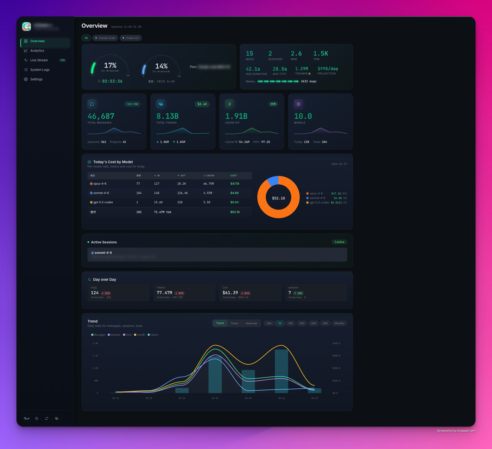
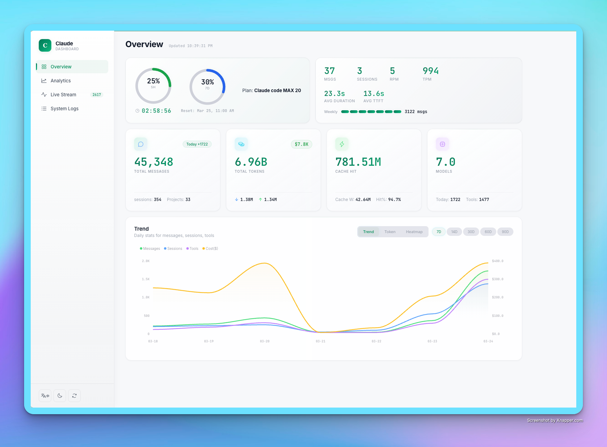
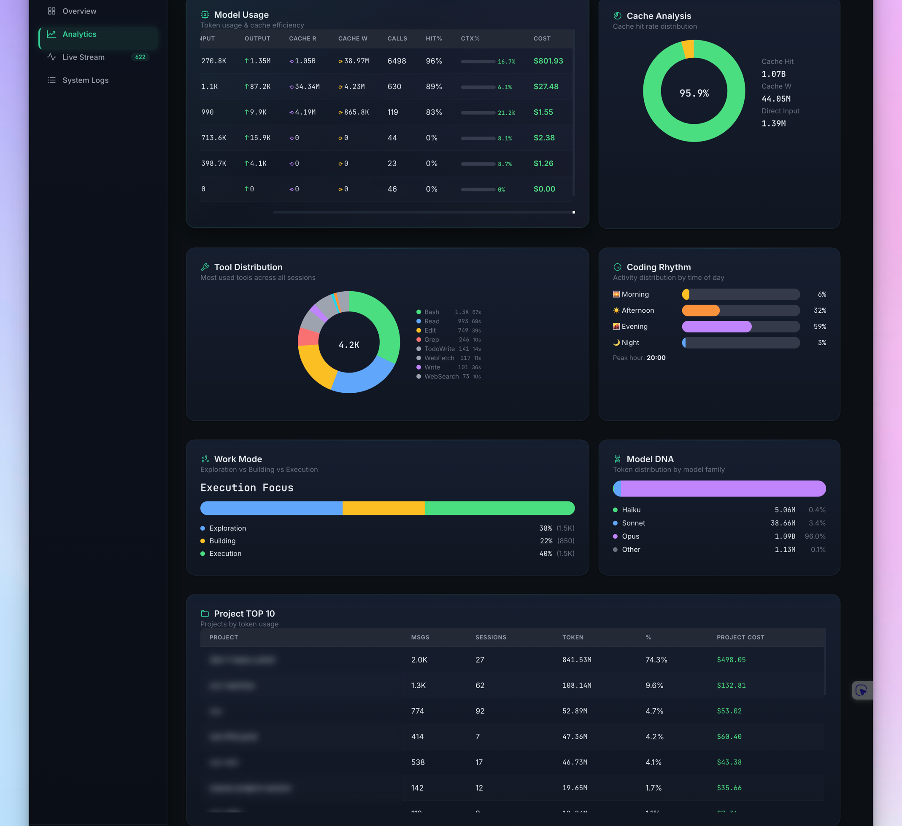
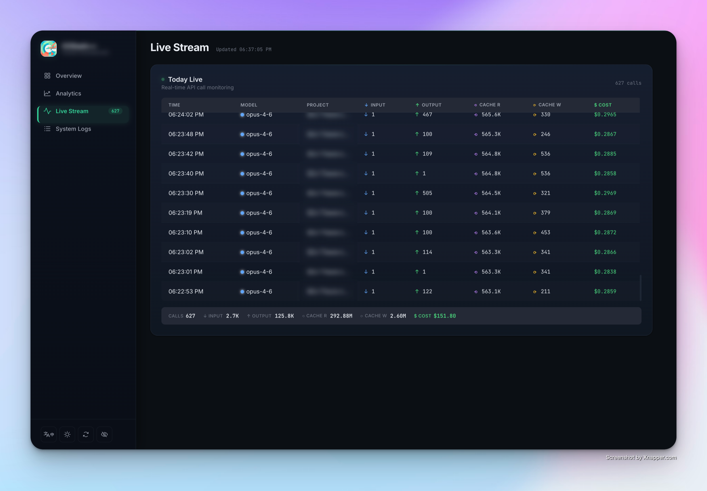
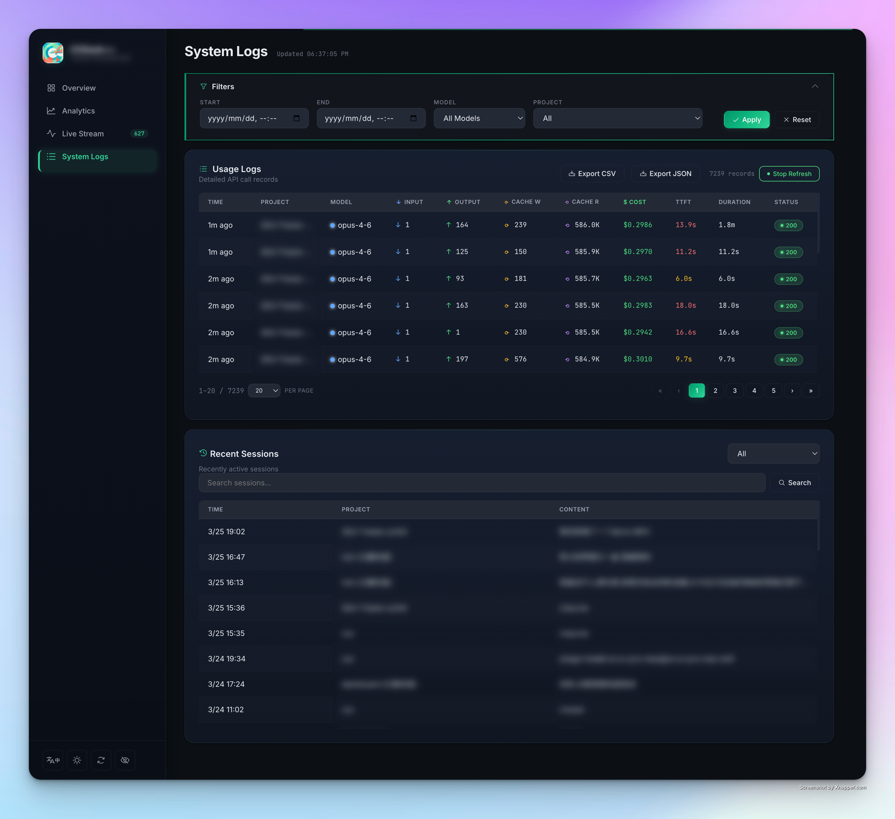

<div align="center">
  
  <h1>CCDash</h1>
  <p><strong>Open-source usage analytics dashboard for Claude Code CLI</strong></p>
  <p>
    <a href="#features">Features</a> &bull;
    <a href="#quick-start">Quick Start</a> &bull;
    <a href="#remote-monitoring">Remote</a> &bull;
    <a href="#configuration">Config</a> &bull;
    <a href="#%E4%B8%AD%E6%96%87%E6%96%87%E6%A1%A3">中文</a>
  </p>
</div>

---

## What is CCDash?

CCDash is a self-hosted, real-time analytics dashboard that monitors your [Claude Code](https://docs.anthropic.com/en/docs/claude-code) CLI usage. It reads directly from Claude Code's local data files -- no API key required, works with subscription plans.

> **Note**: This is a community project and is not affiliated with, endorsed by, or associated with Anthropic.

## Features

- **Real-time Monitoring** -- Live stream of API calls with RPM/TPM metrics
- **Cost Estimation** -- Per-call and aggregate cost based on official Anthropic pricing
- **Multi-source Aggregation** -- Monitor local + remote servers via lightweight agents
- **Subscription Usage Tracking** -- 5-hour and 7-day rolling window utilization (via claude.ai)
- **Rich Analytics** -- Daily trends, model distribution, cache analysis, activity heatmaps
- **Session Browser** -- Search and filter conversation sessions
- **Dark/Light Theme** -- Modern UI with Phosphor icons
- **Bilingual** -- Full Chinese/English interface
- **Zero Dependencies** -- Pure Python backend, vanilla JS frontend

## Screenshots

### Overview — Dark Mode


### Overview — Light Mode


### Analytics


### Live Stream


### System Logs


## Quick Start

### Prerequisites

- Python 3.8+
- Claude Code CLI installed and used (generates data in `~/.claude/`)

### Installation

```bash
git clone https://github.com/user/CCDash.git
cd CCDash
chmod +x start.sh
./start.sh
```

On first run, `start.sh` will create `config.json` from the template and ask you to edit it.

Or run directly:

```bash
cp config.example.json config.json
python3 server.py
```

Open **http://localhost:8420** in your browser.

## Configuration

Edit `config.json`:

```json
{
  "remotes": [],
  "claude_session_key": "",
  "claude_org_id": ""
}
```

| Field | Required | Description |
|-------|----------|-------------|
| `remotes` | No | Remote agent endpoints for multi-server monitoring |
| `claude_session_key` | No | Session key from claude.ai for subscription usage tracking |
| `claude_org_id` | No | Organization ID from claude.ai |

### Getting Session Key (Optional)

To enable 5h/7d subscription usage tracking:

1. Log in to [claude.ai](https://claude.ai)
2. Open DevTools (F12) -> Application -> Cookies
3. Copy the `sessionKey` value
4. Find your org ID in the URL or network request responses

## Remote Monitoring

Deploy `agent.py` on remote servers to aggregate usage from multiple machines:

```bash
# On remote server
python3 agent.py --port 8421 --token your_secret_token
```

Then add the remote to your local `config.json`:

```json
{
  "remotes": [
    {
      "name": "My Server",
      "url": "http://server-ip:8421",
      "token": "your_secret_token",
      "enabled": true
    }
  ]
}
```

Or use SSH tunnel for secure access:

```bash
ssh -L 8421:127.0.0.1:8421 user@server -N -f
```

## Project Structure

```
CCDash/
├── server.py          # Main dashboard backend
├── agent.py           # Remote monitoring agent
├── fetch-usage.swift  # macOS helper for claude.ai usage API
├── config.json        # Your local config (not tracked by git)
├── config.example.json
├── start.sh           # Convenience launcher
├── web/
│   ├── index.html     # Dashboard UI
│   ├── style.css      # Zinc-gray SaaS theme
│   └── app.js         # Frontend logic
├── logo.png
├── screenshot/
├── LICENSE            # MIT
└── README.md
```

## Tech Stack

- **Backend**: Python stdlib (`http.server`, `json`, `threading`) -- no pip install needed
- **Frontend**: Vanilla JS + [ApexCharts](https://apexcharts.com/) + [Phosphor Icons](https://phosphoricons.com/) + [Notyf](https://github.com/caroso1222/notyf)
- **Data**: Reads Claude Code's JSONL session files directly from `~/.claude/`

## How It Works

1. Claude Code CLI stores session data as JSONL files in `~/.claude/projects/`
2. CCDash's backend scans these files and aggregates token usage, model distribution, and session metadata
3. The frontend polls the backend API and renders real-time charts and metrics
4. Optionally, the Swift helper fetches subscription utilization data from claude.ai

## License

[MIT](LICENSE)

---

## 中文文档

### CCDash 是什么？

CCDash 是一个自托管的实时分析面板，用于监控你的 [Claude Code](https://docs.anthropic.com/en/docs/claude-code) CLI 使用情况。它直接读取 Claude Code 的本地数据文件，无需 API Key，支持订阅计划。

> **注意**：这是一个社区项目，与 Anthropic 无关。

### 界面预览

| 概览（暗色） | 概览（亮色） |
|:---:|:---:|
|  |  |

| 分析 | 实时监控 |
|:---:|:---:|
|  |  |

### 功能特性

- **实时监控** -- API 调用实时流，RPM/TPM 指标
- **成本估算** -- 基于 Anthropic 官方定价的单次和累计成本
- **多源聚合** -- 通过轻量 Agent 监控本地和远程服务器
- **订阅用量追踪** -- 5 小时和 7 天滚动窗口使用率（通过 claude.ai）
- **丰富分析** -- 每日趋势、模型分布、缓存分析、活动热力图
- **会话浏览** -- 搜索和筛选对话会话
- **深色/浅色主题** -- 现代化 UI
- **中英双语** -- 完整的中英文界面
- **零依赖** -- 纯 Python 后端，原生 JS 前端

### 快速开始

```bash
git clone https://github.com/user/CCDash.git
cd CCDash
chmod +x start.sh
./start.sh
```

首次运行时，`start.sh` 会从模板创建 `config.json` 并提示你编辑。

或直接运行：

```bash
cp config.example.json config.json
python3 server.py
```

在浏览器中打开 **http://localhost:8420**。

### 配置说明

编辑 `config.json`：

| 字段 | 必填 | 说明 |
|------|------|------|
| `remotes` | 否 | 远程 Agent 端点列表，用于多服务器监控 |
| `claude_session_key` | 否 | claude.ai 的 Session Key，用于订阅用量追踪 |
| `claude_org_id` | 否 | claude.ai 的组织 ID |

#### 获取 Session Key（可选）

1. 登录 [claude.ai](https://claude.ai)
2. 打开开发者工具 (F12) -> Application -> Cookies
3. 复制 `sessionKey` 的值
4. 在 URL 或网络请求中找到组织 ID

### 远程监控

在远程服务器上部署 `agent.py`：

```bash
# 远程服务器
python3 agent.py --port 8421 --token your_secret_token
```

在本地 `config.json` 中添加远程节点：

```json
{
  "remotes": [
    {
      "name": "云服务器",
      "url": "http://server-ip:8421",
      "token": "your_secret_token",
      "enabled": true
    }
  ]
}
```

也可以使用 SSH 隧道进行安全访问：

```bash
ssh -L 8421:127.0.0.1:8421 user@server -N -f
```

### 许可证

[MIT](LICENSE)
